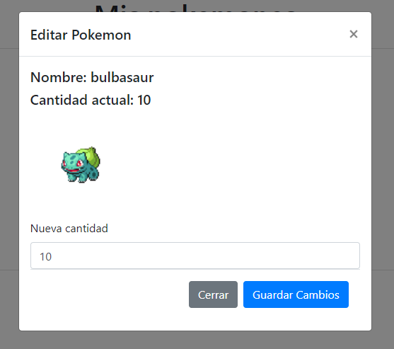

## Desafío 3: CRUD en JavaScript
Continuando con la actividad vista en clases de JavaScript. Deberá realizar las siguientes mejoras al proyecto:

-	Cada vez que un Pokémon se agregue por primera vez al arreglo “misPokemones”, deberá tener la propiedad quantity con el valor de 1.
-	En el caso de que el Pokémon a agregar ya exista en el arreglo, se deberá incrementar su propiedad quantity en 1.
-	Se debe actualizar el botón eliminar para que cada vez que el usuario haga clic cumpla las siguientes condiciones:
    -	Si su propiedad quantity es igual a 1 se eliminar el Pokémon del arreglo “misPokemones”.
    -	Si su propiedad quantity es mayor a 1 se debe decrementar su propiedad quantity en 1.
-	Implementar un modal de Bootstrap para editar un Pokémon: en este modal el usuario podrá editar la cantidad del Pokémon seleccionado.
    - Los valores del input cantidad deben ser numéricos, con un valor mínimo de 1.
    - En caso de que el usuario ingrese un valor igual o menor a 0 se debe arrojar un alert() indicando su error.
    - *Ejemplo del Modal:*
    
    

**Nota**: todos los elementos y eventos de inputs o botones creados con “innerHTML y Template String” deben ser capturados y ejecutados utilizando el DOM **(No usar jQuery).**
